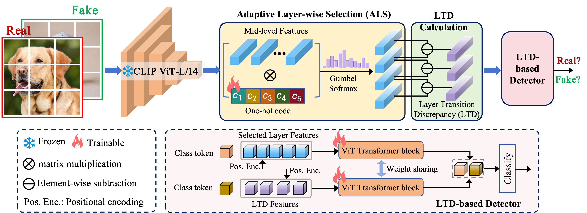

# Layer Consistency Matters: Elegant Latent Transition Discrepancy for Generalizable Synthetic Image Detection

<div align="center">

<!-- **CVPR 2026 Accepted** -->

<!-- [**Paper**](link_to_paper) | [**Project Page**](link_to_project) | [**Video**](link_to_video) -->

</div>

## 📖 Introduction

This repository contains the official implementation of the paper "Layer Consistency Matters: Elegant Latent Transition Discrepancy for Generalizable Synthetic Image Detection".

<div align="center">
  
</div>

<!-- ## 🔈 News
- **[2026.03]** 🎉 Our paper has been accepted to **CVPR 2026**! -->

## 🛠️ Installation

1. **Clone the repository:**
   ```bash
   git clone https://github.com/yywencs/LTD.git
   cd LTD
   ```

2. **Create a virtual environment:**
   ```bash
   conda create -n LTD python=3.9.23
   conda activate LTD
   ```

3. **Install dependencies:**
   ```bash
   pip install -r requirements.txt
   ```

## 🚀 Usage

### Data Preparation
comming soon.

### Training
To train the model, run the following command:
```bash
bash train.sh
```
**Note:** You may need to modify the arguments in `train.sh` (e.g., `--wang2020_data_path`, `--checkpoints_dir`) to match your local environment and dataset paths.

### Evaluation
To evaluate the model, run:
```bash
bash test.sh
```
Make sure to update the `--ckpt` path in `test.sh` to point to your trained model checkpoint.

## 🏰 Pretained Model

| Dataset | Baidu Netdisk | Google Drive |
| :--- | :--- | :--- |
| **UFD\GenImage** | [Link](TBD) | [Link](TBD) |
| **DRCT-2M** | [Link](TBD) | [Link](TBD) |

*(More checkpoints will be released soon.)*

## 💡 Citation
If you find this work useful for your research, please consider citing our paper:
```bibtex
@inproceedings{yang2026LTD,
  title={Layer Consistency Matters: Elegant Latent Transition Discrepancy for Generalizable Synthetic Image Detection},
  author={Yang, Yawen and Li, Feng and Kong, Shuqi and Diao, Yunfeng and Gao, Xinjian and Shi, Zenglin and Wang, Meng},
  booktitle={Proceedings of the IEEE/CVF Conference on Computer Vision and Pattern Recognition (CVPR)},
  year={2026}
}
```

## 🙏 Acknowledgements
This project is built upon [UniversalFakeDetect](https://github.com/WisconsinAIVision/UniversalFakeDetect). We thank the authors for their open-source contribution.
